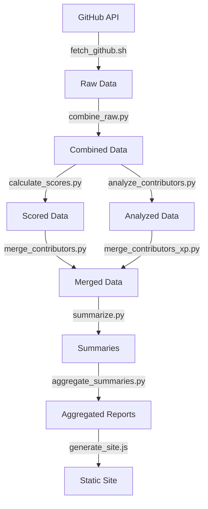
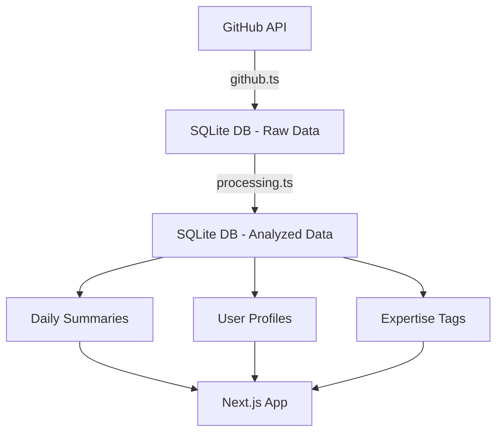

# Contributor Analytics System

This system automates the collection, analysis, and visualization of GitHub contributor activity. It runs daily via GitHub Actions and generates various reports and summaries.

## New TypeScript Analytics Pipeline

A new TypeScript-based pipeline has been implemented, leveraging SQLite and Drizzle ORM for improved data management and processing:

### Key Features

- Normalized database schema for efficient storage of GitHub data
- Highly configurable scoring and tagging system via TypeScript configuration
- Advanced pattern matching for expertise recognition
- Comprehensive CLI for managing the entire pipeline
- Streamlined processing that eliminates the need for multiple scripts

### Quick Start (TypeScript Pipeline)

```bash
# Initialize the database
bun run pipeline init

# Ingest GitHub data (default: last 7 days)
bun run pipeline ingest

# Process and analyze (default: last 30 days)
bun run pipeline process

# Or run the entire pipeline
bun run pipeline run
```

### Configuration

The pipeline is configurable through TypeScript config at `config/pipeline.config.ts`, where you can customize:

- Repositories to track
- Scoring rules for different contribution types
- Tag definitions and weights
- AI summarization settings (optional)

## Legacy Python Scripts

The original system consists of several Python and shell scripts that work together:

### Data Collection

- `scripts/legacy/fetch_github.sh`: Fetches raw GitHub data (PRs, issues, commits) using GitHub's GraphQL API
- `scripts/legacy/combine_raw.py`: Combines raw GitHub data into a unified contributor activity format

### Analysis & Processing

- `scripts/legacy/calculate_scores.py`: Calculates contributor scores based on various metrics (PRs, commits, engagement)
- `scripts/legacy/analyze_contributors.py`: Performs detailed analysis of contributor activity, generates tags and insights
- `scripts/legacy/merge_contributors.py`: Merges contributor data across multiple time periods
- `scripts/legacy/merge_contributors_xp.py`: Merges contributor experience/level data with main contributor data

### Summary Generation

- `scripts/legacy/summarize.py`: Generates human-readable summaries of contributor activity
- `scripts/legacy/summarize_daily.py`: Creates daily activity summaries with metrics and insights
- `scripts/legacy/aggregate_summaries.py`: Aggregates summaries across time periods
- `scripts/legacy/aggregate_temporal.py`: Handles temporal aggregation of contributor data

### History Management

- `scripts/legacy/manage_thread_history.sh`: Manages versioning and backup of discussion threads
- `scripts/legacy/update_historical_summaries.py`: Updates historical summary data
- `scripts/legacy/generate_history_summaries.sh`: Generates historical summary reports

### Site Generation

- `scripts/generate_site.js`: Generates static contributor profile pages
- `scripts/components/ContributorProfile.js`: React component for contributor profiles

## GitHub Actions Workflow

The system uses `weekly-summaries.yml` for automated data processing:

### Daily Workflow

1. Runs at 5:30 PM EST daily
2. Creates directories:
   ```
   data/daily/
   data/daily/history/
   ```
3. Fetches data:
   - PRs, issues, commits for last 24 hours
   - Saves to both current and historical locations
4. Processes data:
   - Combines raw data
   - Calculates scores
   - Generates summaries
   - Updates historical merge data

### Weekly Workflow (Fridays)

1. Runs at 6:00 PM EST on Fridays
2. Combines last 7 days of daily data
3. Generates weekly summaries
4. Creates and manages weekly discussion threads
5. Aggregates weekly analysis

### Monthly Workflow (4th of month)

1. Runs at 6:30 PM EST on the 4th
2. Combines last 31 days of daily data
3. Generates monthly summaries
4. Aggregates monthly analysis

## Data Flow Comparison

### Legacy Python Pipeline



### New TypeScript Pipeline



## Data Storage

- `data/daily/`: Current day's data (legacy)
- `data/daily/history/`: Historical daily data (legacy)
- `data/weekly/`: Weekly aggregated data (legacy)
- `data/monthly/`: Monthly aggregated data (legacy)
- `data/db.sqlite`: SQLite database (new TypeScript pipeline)

## Environment Setup

Required environment variables:

- `GH_TOKEN`: GitHub access token
- `OPENROUTER_API_KEY`: OpenRouter API key for AI summaries (optional)
- `SITE_URL`: Site URL for OpenRouter integration (optional)
- `SITE_NAME`: Site name for OpenRouter integration (optional)

## Development Notes

- The new TypeScript pipeline is designed to eventually replace the Python scripts
- Both systems can run side by side during migration
- The TypeScript pipeline uses SQLite for improved data normalization and querying
- The scoring system is fully configurable and can be adjusted for different community needs
- Data processing prioritizes robustness for handling API rate limits and errors
