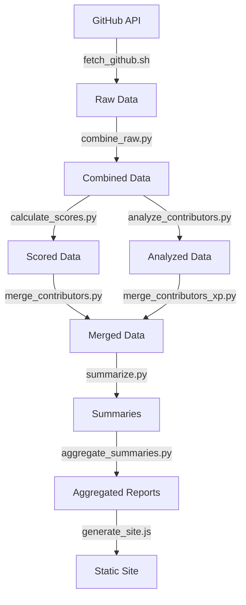

# Contributor Analytics System

This system automates the collection, analysis, and visualization of GitHub contributor activity. It runs daily via GitHub Actions and generates various reports and summaries.

## Scripts Overview

### Data Collection
- `scripts/fetch_github.sh`: Fetches raw GitHub data (PRs, issues, commits) using GitHub's GraphQL API
- `scripts/combine_raw.py`: Combines raw GitHub data into a unified contributor activity format

### Analysis & Processing
- `scripts/calculate_scores.py`: Calculates contributor scores based on various metrics (PRs, commits, engagement)
- `scripts/analyze_contributors.py`: Performs detailed analysis of contributor activity, generates tags and insights
- `scripts/merge_contributors.py`: Merges contributor data across multiple time periods
- `scripts/merge_contributors_xp.py`: Merges contributor experience/level data with main contributor data

### Summary Generation
- `scripts/summarize.py`: Generates human-readable summaries of contributor activity
- `scripts/summarize_daily.py`: Creates daily activity summaries with metrics and insights
- `scripts/aggregate_summaries.py`: Aggregates summaries across time periods
- `scripts/aggregate_temporal.py`: Handles temporal aggregation of contributor data

### History Management
- `scripts/manage_thread_history.sh`: Manages versioning and backup of discussion threads
- `scripts/update_historical_summaries.py`: Updates historical summary data
- `scripts/generate_history_summaries.sh`: Generates historical summary reports

### Site Generation
- `scripts/generate_site.js`: Generates static contributor profile pages
- `scripts/components/ContributorProfile.js`: React component for contributor profiles

## GitHub Actions Workflow

The system uses `weekly-summaries.yml` for automated data processing:

### Daily Workflow
1. Runs at 5:30 PM EST daily
2. Creates directories:
   ```
   data/daily/
   data/daily/history/
   ```
3. Fetches data:
   - PRs, issues, commits for last 24 hours
   - Saves to both current and historical locations
4. Processes data:
   - Combines raw data
   - Calculates scores
   - Generates summaries
   - Updates historical merge data

### Weekly Workflow (Fridays)
1. Runs at 6:00 PM EST on Fridays
2. Combines last 7 days of daily data
3. Generates weekly summaries
4. Creates and manages weekly discussion threads
5. Aggregates weekly analysis

### Monthly Workflow (4th of month)
1. Runs at 6:30 PM EST on the 4th
2. Combines last 31 days of daily data
3. Generates monthly summaries
4. Aggregates monthly analysis

## Data Flow



## Data Storage

- `data/daily/`: Current day's data
- `data/daily/history/`: Historical daily data
- `data/weekly/`: Weekly aggregated data
- `data/monthly/`: Monthly aggregated data

## Environment Setup

Required environment variables:
- `GH_TOKEN`: GitHub access token
- `OPENROUTER_API_KEY`: OpenRouter API key for AI summaries
- `SITE_URL`: Site URL for OpenRouter integration
- `SITE_NAME`: Site name for OpenRouter integration

## Development Notes

- AI summaries use either OpenAI via OpenRouter or local Ollama
- All temporal data is stored with timestamps for historical tracking
- Profile generation uses React with Tailwind CSS
- Data processing prioritizes robustness for handling API rate limits and errors
